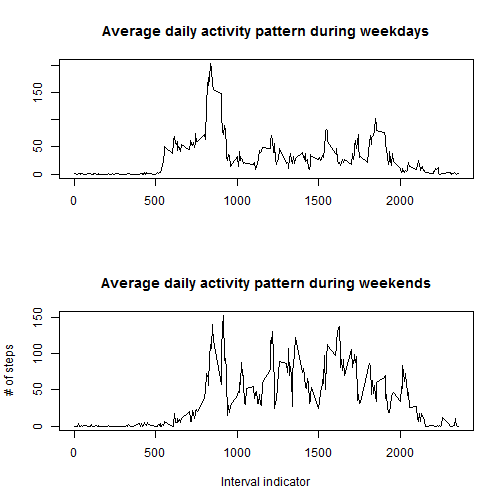

## Assignment 1


### Loading and preprocessing the data

First we will unzip the file with tha data. Remember, that the source data file must be downloaded to your working directory.


```r
unzip("repdata-data-activity.zip", exdir = ".")
```

Then we will load the data needed for the analysis. 


```r
data <- read.csv("./activity.csv")
```

### What is mean total number of steps taken per day?

Let`s calculate total number of step taken per day. So the code will sum steps for each date (skipping the NA values). Then we put the result in a nice data frame. 


```r
A <- tapply(data$steps, data$date, sum, na.rm = T)
head(A)
```

```
## 2012-10-01 2012-10-02 2012-10-03 2012-10-04 2012-10-05 2012-10-06 
##          0        126      11352      12116      13294      15420
```

And let`s take a look at a histogram of the total number of steps taken per day. 


```r
hist(A, main = "Histogram of number of steps taken per day", xlab = "Number of steps taken per day")
```

 

And now let`s calculate mean and median of the total number of steps taken per day


```r
mean(A)
```

```
## [1] 9354.23
```


```r
median(A)
```

```
## [1] 10395
```

### What is the average daily activity pattern?

Let`s prepare data for the analysis. We need a table with intervals and averages of the number of seps in each interval over the whole period. 


```r
B <- tapply(data$steps, data$interval, mean, na.rm = T)
C <- data.frame(as.numeric(as.character(row.names(B))), as.numeric(B), row.names = NULL)
colnames(C) <- c("interval", "average steps per interval")
```

And let`s see on a plot, what is average activity daily pattern. 


```r
plot(C[,1], C[,2], type = "l", main = "Average daily activity pattern", xlab = "Interval indicator", ylab = "Average number of steps in given interval")
```

 

We can also check, which interval contains maximum number os steps.


```r
C[C[,2] == max(C[,2]),]
```

```
##     interval average steps per interval
## 104      835                   206.1698
```

### Imputing missing values

Now let`s check, how many missing values are there in our dataset. 


```r
sum(is.na(data[,1]))
```

```
## [1] 2304
```

There are quite a few of them. We will try to fill the NA values with the first value that appears next in time series. Let`s build new dataset with all NAs filled in.


```r
datam <- data
i <- 1

for (i in 1:17568) {
  if (is.na(datam[i,1])) {
    j <- i + 1
    while (is.na(datam[j,1])) {
      if (j >= 17568) {
        k <- i -1
        datam[i:17568,1] <- datam[k,1]
        break
      }
      else {j <- j + 1};
    }
    datam[i,1] <- datam[j,1]
  }
}
```

Now we will check, how does the histogram of total number of steps taken each day look like after the chages...


```r
D <- tapply(datam$steps, datam$date, sum, na.rm = T)
hist(A, main = "Histogram of number of steps taken per day (filled NAs)", xlab = "Number of steps taken per day")
```

 

...and calculate mean and median for the new dataset. 


```r
mean(D)
```

```
## [1] 9354.23
```

```r
median(D)
```

```
## [1] 10395
```

The values did not change, as the filled in values were in this case all equal to "0". So building a vector of daily sums of steps (with tapply), we received the same result. The table A and D are exactly the same. 

### Are there differences in activity patterns between weekdays and weekends?

Finally let`s see, what are the patterns during weekdays and weekends. Firstly, the column indicating weekdays and weekends shall be added to the dataset. 


```r
datam[,2] <- as.Date(datam[,2])
datam$weekdays <- format(datam[,2], "%u")
datam[,4] <- as.numeric(datam[,4])
l <- 1

for (l in 1:length(datam$weekdays)) {
  if (datam[l,4] < 6) {
    datam[l,4] <- "weekday"
  }
  else {datam[l,4] <- "weekend"}
}

datam[,4] <- factor(datam[,4])
```

And finally let`s see on a plot, what is an average number of steps taken during the weekdays and the weekend. Let`s prapare the dataset first...


```r
library(plyr)
E <- ddply(datam, .(weekdays, interval), summarise, mean = mean(steps, na.rm = T))
F <- E[E[,1] == "weekday",]
G <- E[E[,1] == "weekend",]
```

...and now we can plot the data.


```r
par(mfrow = c(2,1))
plot(F[,2], F[,3], type = "l", main = "Average daily activity pattern during weekdays", xlab = "", ylab = "")
plot(G[,2], G[,3], type = "l", main = "Average daily activity pattern during weekends", xlab = "Interval indicator", ylab = "# of steps")
```

 
